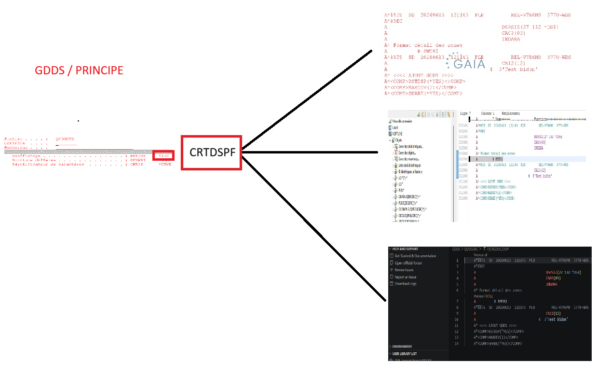
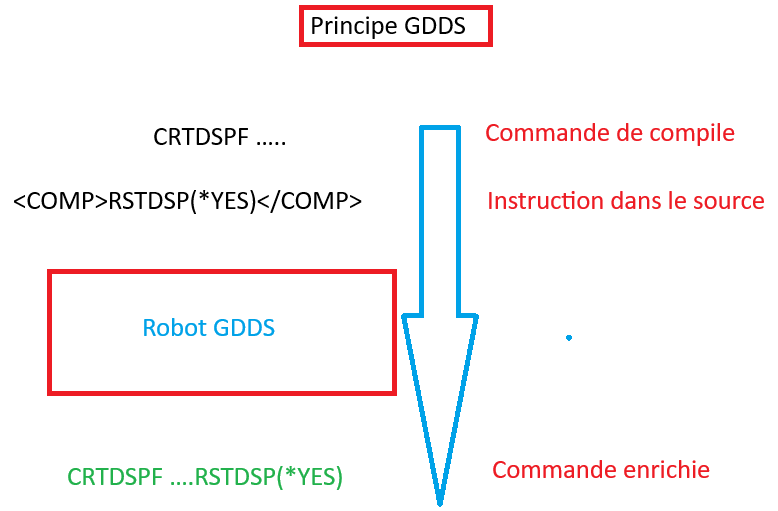
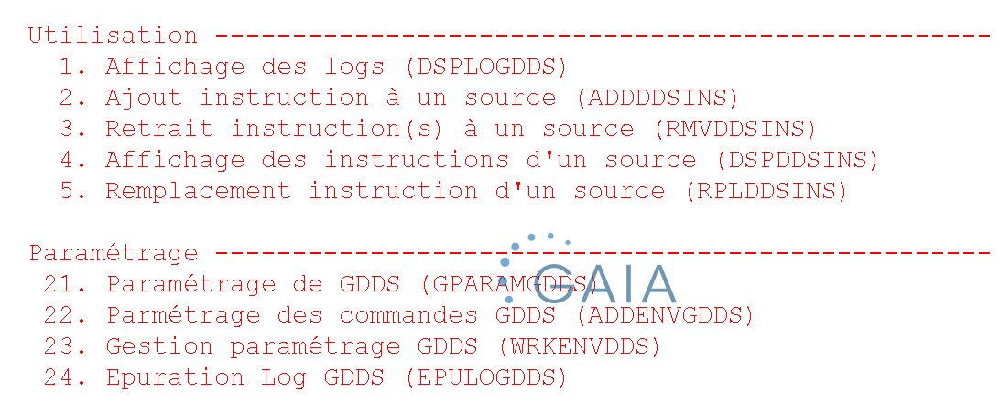
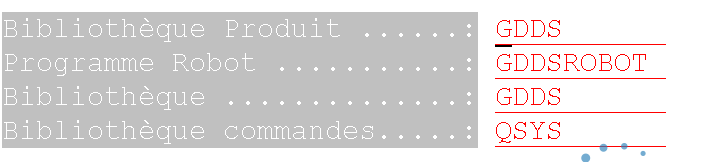
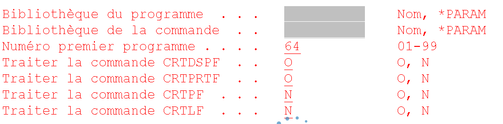
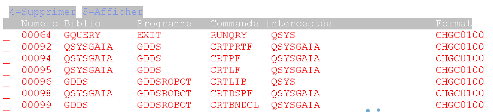
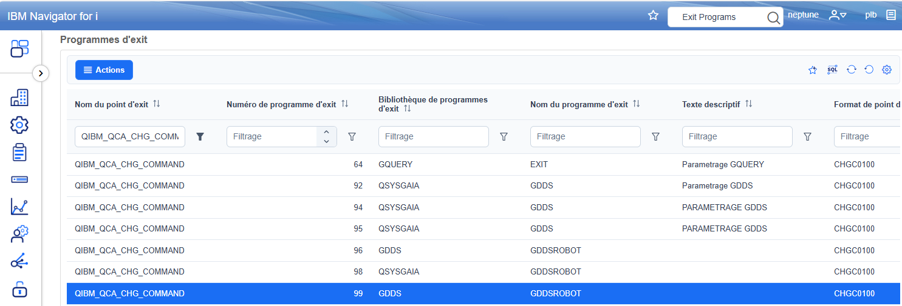
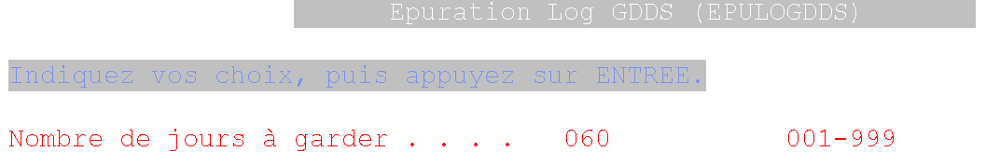
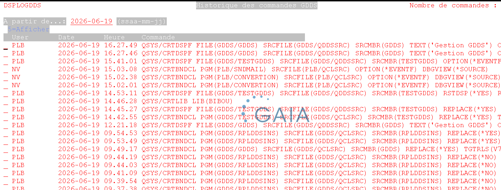
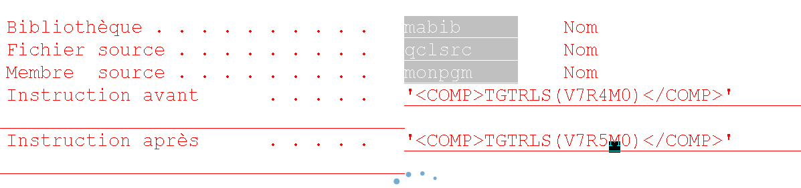

# Logiciel GDDS

## But

Le but de ce logiciel est de garder les options de compilation sur les commandes CRT pour les DDS :

- CRTPRTF
- CRTDSPF
- CRTPF
- CRTLF

Par exemple, vous souhaitez indiquer `RSTDSP(*YES)` sur un DSPF. Lors de la compilation avec `CRTDSPF`, ce paramètre doit être saisi manuellement.

On n'a pas de possibilité d'enregistrer ce paramètre dans le source du DSPF.

L'idée est de créer un langage qui inclut ces paramètres :

Nous l'avons formalisé sous forme de 2 balises 
<COMP> et </COMP> 

**exemple**<br>
ca ressemble à un xml
```xml 
<COMP>RSTDSP(*YES)</COMP>

Vous pouvez avoir plusieurs balises sur la même ligne ! 
La limite c'est 80 caratctères bornes comprises
Exemple
     A* <COMP>RSTDSP(*YES) MAXDEV(2)</COMP> 
```

Lors de la compilation, cette option est ajoutée automatiquement, quelle que soit la méthode utilisée : SEU, SDA, RDi ou VS Code.

Si vous décidez d'abandonner ce logiciel , vous garder le commentaire dans votre source, sans probléme de compile 



## Principe

On utilise un point d'exit, pour capturer la commande  c'est :

`QIBM_QCA_CHG_COMMAND`

Une entrée est ajoutée pour intercepter les commandes voulues. Le robot GDDS enrichit alors automatiquement la commande.



## Le logiciel


Chaque action peut se matérialiser par une commande 
**exemple :**
```clle
 RPLDDSINS LIBSRC(MABIB)                          
           FICSRC(QCLSRC)                         
           MBRSRC(EXPLOIT12)                      
           OLDCHAR('<COMP>TGTRLS(V7R4M0)</COMP>') 
           NEWCHAR('<COMP>TGTRLS(V7R5M0)</COMP>') 
```           
           

Ce qui peut vous permettre d'intégrer ces actions dans VSCODE ou RDI ou dans des programme CLLE

On fournit un menu GDDS qui permet de voir les différentes options disponibles 

### L'installation 

Vous recevez une bibliothèque souvent GDDSD.
Elle est compilée pour une V7R4M0
Il vous suffit de la restauter soit par ACS , soit par FTP
Si vous avez une version ultérieure, vous pouvez retrouver le code sur le github Gaia et recompiler les composants
dans l'ordre, fichier table, fichier DSPF, programmes et commandes 

### Le paramétrage

Vous disposez d'un menu GDDS.



### Option 21

Paramétrage général du logiciel.




Cette option contient les paramètres par défaut.
Comme la bibliothèque du logiciel et le robot de traitement et sa bibliothèque 
C'est le fichier GDDSPARAM 

### Option 22

Association des commandes avec le robot GDDS.
Permet l'association rapide pour dspf et prtf



L'utilisation de `*PARAM` permet de récupérer les valeurs par défaut du fichier GDDSPARAM.

### Option 23

Gestion avancée des commandes associées.



Vous retrouvez les commandes traitées par GDDS, vous pouvez egalement passer par WRKREGINF ou par NAVIGATOR For i , vous avez intêret à réorganiser vos zones. 



Mais vous aurez un assistant sur l'interface GDDS pour les noms de programme et de bibliothèque 

#### Remarques

Le principal usage est sur les PRTF et DSPF mais pas que 


Il Fonctionne également avec des commandes sur les autres sources :

- CRTBNDCL
- CRTBNDRPG

**Exemple** à connaitre:

Pour gérer la version dans des programme CCLE ou RPGLE

```xml
/* <COMP>TGTRLS(V7R4M0)</COMP> */
```

Pour une commande , gérer le programme de traitement CRTCMD :

```xml
/* <COMP> CRTCMD PGM(PGMTRAITE) </COMP> */
```

Pour un LF, gérer forcer la taille de la page d'index dans le CRTLF :

```xml
/* <COMP>PAGESIZE(64)</COMP> */
```
Etc ...

Il est possible de tracer l'utilisation d'une commande sans source.

**Exemple :** `CRTLIB`

Chaque utilisation sera enregistrée dans le fichier `LOGGDDS`.
il n'y a pas d'interdiction prévue , mais ca evite le demarrage d'un audit

**Restrictions techniques liées à l'exit programme:** 

Vous ne pouvez associer qu'un seul programme à une commande 
Vous ne pouvez pas avoir 2 fois le même numéro de programme

### Option 24

Permet d'épurer les journaux du fichier LOGGDDS.
En régle général on garde 30 à 60 jours 
Vous pouvez plannifier cette taches  

**Exemple :**
```clle 
ADDJOBSCDE JOB(EPUGDDS)              
           CMD(GDDSD/EPULOGDDS)      
           FRQ(*WEEKLY)              
           SCDDATE(*NONE)            
           SCDDAY(*SAT)              
           SCDTIME(150000)           
           JOBQ(QSYSNOMAX)           
           USER(VOTREUSER)           
           TEXT('Epuration loggdds') 
```


## L'utilisation

### Option 1

Affichage des appels du programme robot, avec la commande transformée.



Vous pouvez également interroger directement le fichier par SQL:

```sql
SELECT * FROM LOGGDDS;
```

### Options 2, 3 et 5

Gestion des directives de compilation.
   - ADDDDSINS Ajouter une directive dans un source
   - RMVDDSINS Enlever les directives du source
   - DSPDDSINS Afficher les directives du source
   - RPLDDSINS remplacer une directive d'un source 

Vous pouvez agir en masse sur les directives présentes dans les sources.


**Exemple :**



Ici, la version cible passe de `V7R4M0` à `V7R5M0`.

``` clle
PGM
DCLF       FILE(QSYS/QAFDMBRL)
             DSPFD      FILE(&LIBSRC/QSQLSRC) TYPE(*MBRLIST) +    
                          OUTPUT(*OUTFILE) OUTFILE(QTEMP/WAFDMBRL)
MONMSG     MSGID(CPF3012)  
 OVRDBF     FILE(QAFDMBRL) TOFILE(QTEMP/WAFDMBRL)
 DOUNTIL    COND(&FIN_FIC)                       
     RCVF                                        
     MONMSG     MSGID(CPF0864) EXEC(DO)          
        LEAVE     
     ENDDO   
RPLDDSINS LIBSRC(&MLLIB)                          
           FICSRC(&MLFILE)                         
           MBRSRC(&MLNAME)                      
           OLDCHAR('<COMP>TGTRLS(V7R4M0)</COMP>') 
           NEWCHAR('<COMP>TGTRLS(V7R5M0)</COMP>') 
 ENDDO
DLTOVR     FILE(QAFDMBRL)
ENDPGM 
```

## Divers

### Limitations

- L'ajout de programmes nécessite l'autorité `*SECADM`.
- Si une directive de compilation est déjà présente avant enrichissement, le traitement échoue. 
Cette limitation est prévue pour être corrigée dans une version future.

